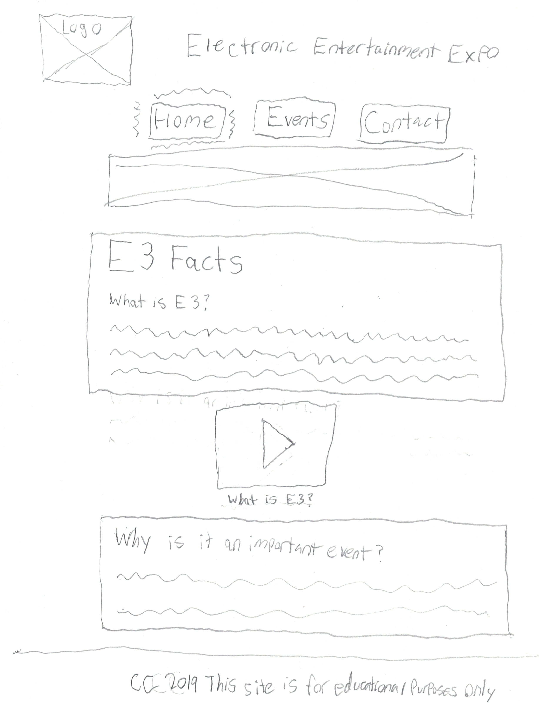
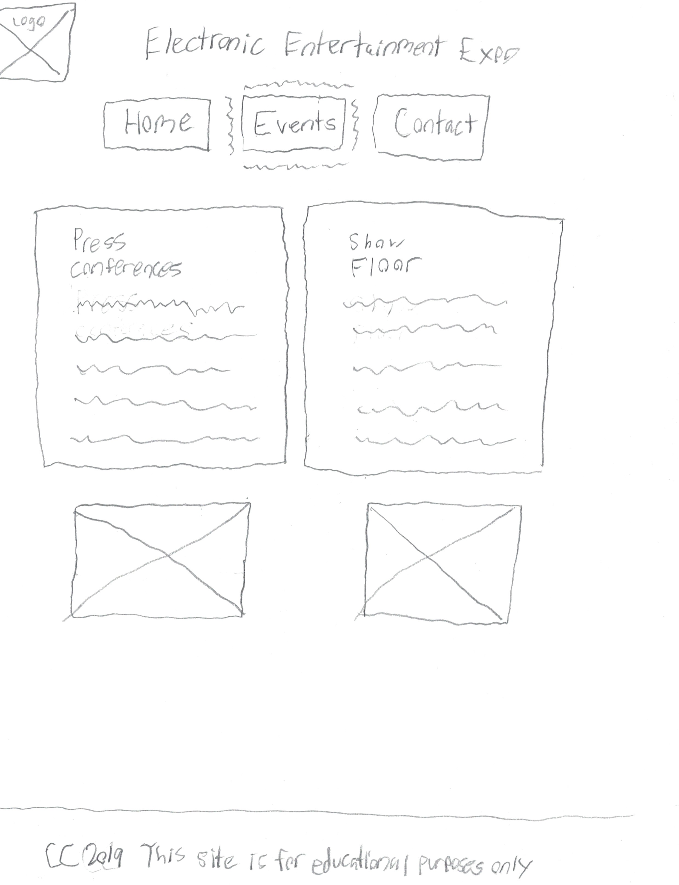
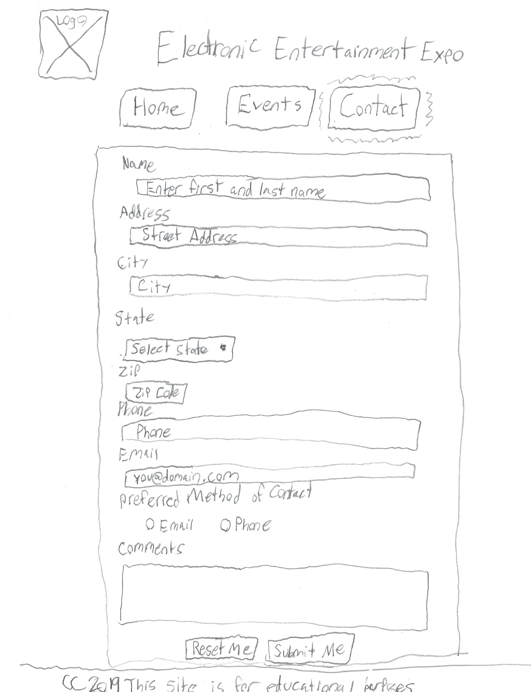

# E3Project

This is my Final Project for my Introduction to Web Authoring class at ASU. I used HTML and CSS to make this project. This website is about the Electronic Entertainment
Expo that takes place once a year in California. It is a gaming convention where announcements take place and where many of the big publishers go to. I do not own the 
photos or the video provided. The images were found on Google and the video was found on YouTube. Here is the link to my website: 
www.public.asu.edu/~jlflemi3/GIT215/FLEMING_FINAL_PART2/index.html

These are the wireframes that I created before starting development of the project. 

Here is the wireframe for the home page:

Here is the wireframe for the events page:

Here is the wireframe for the contact page: 

